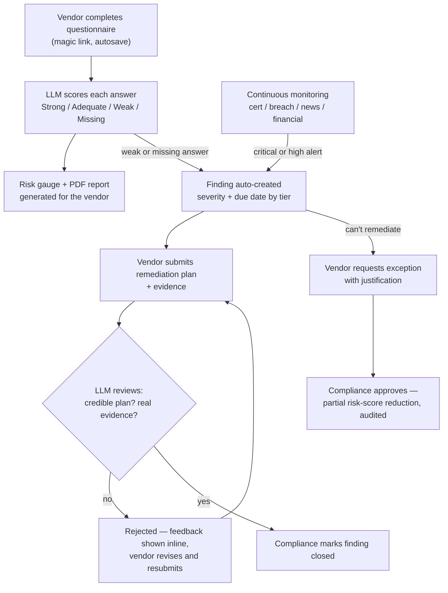
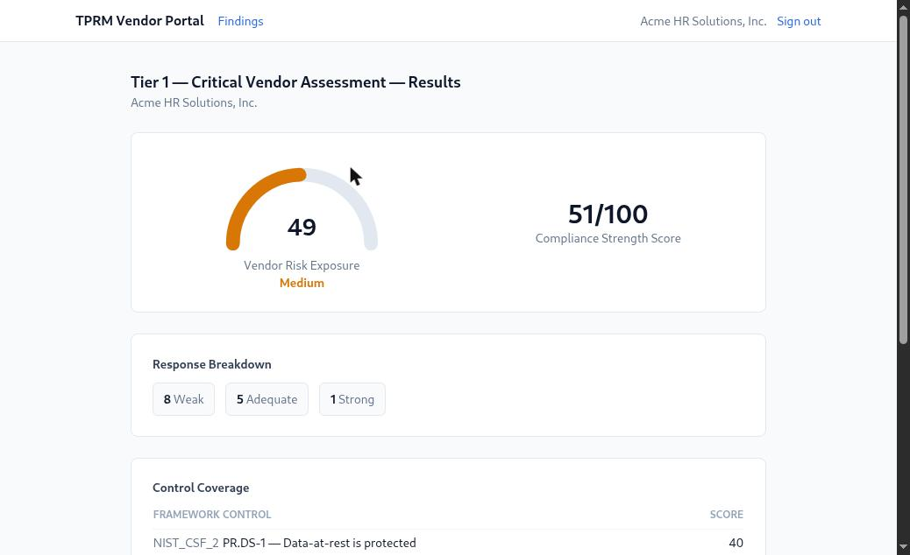
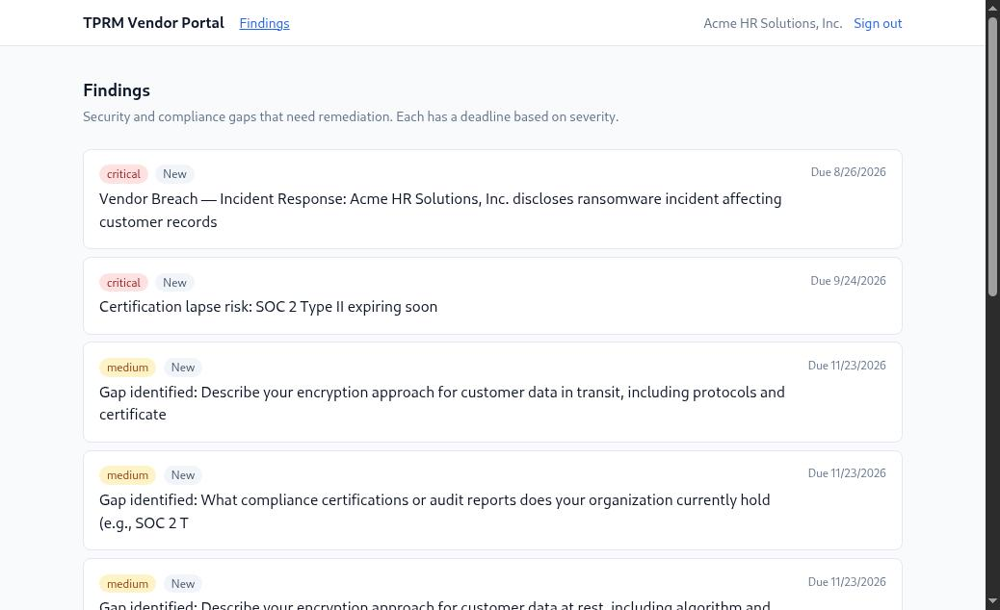
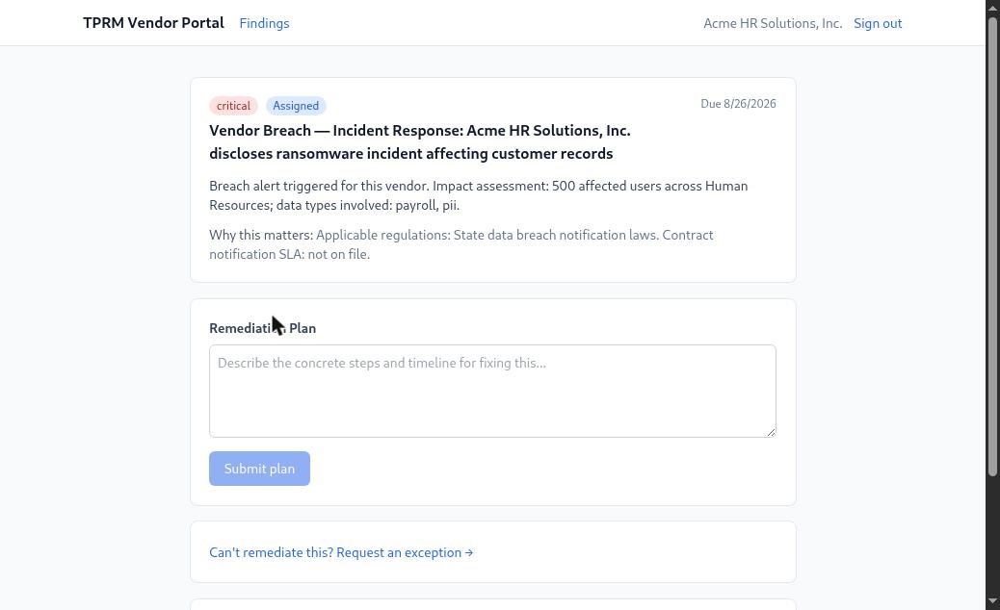
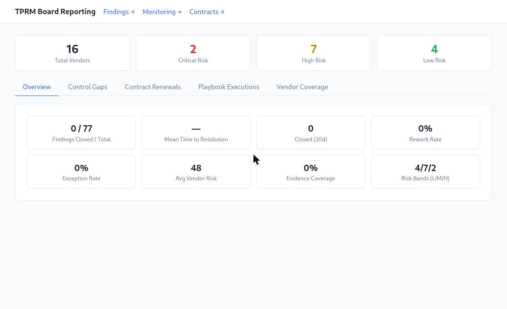
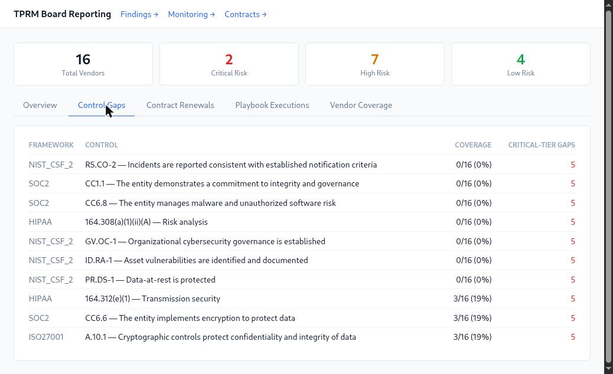
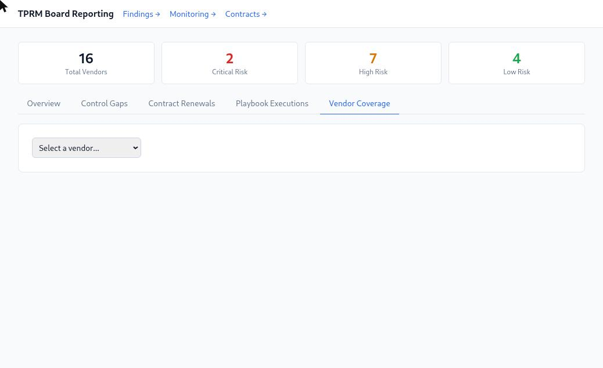
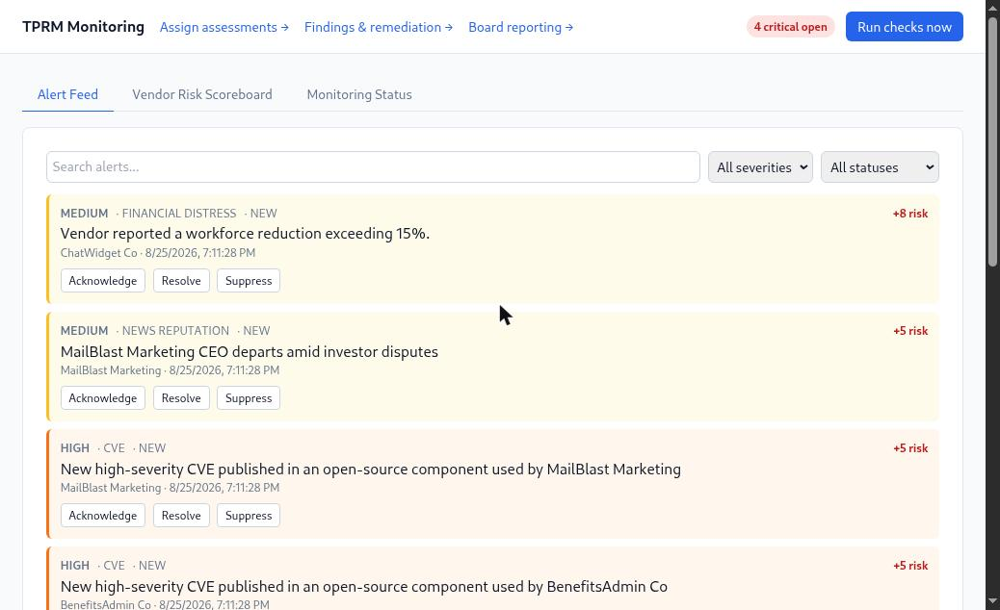
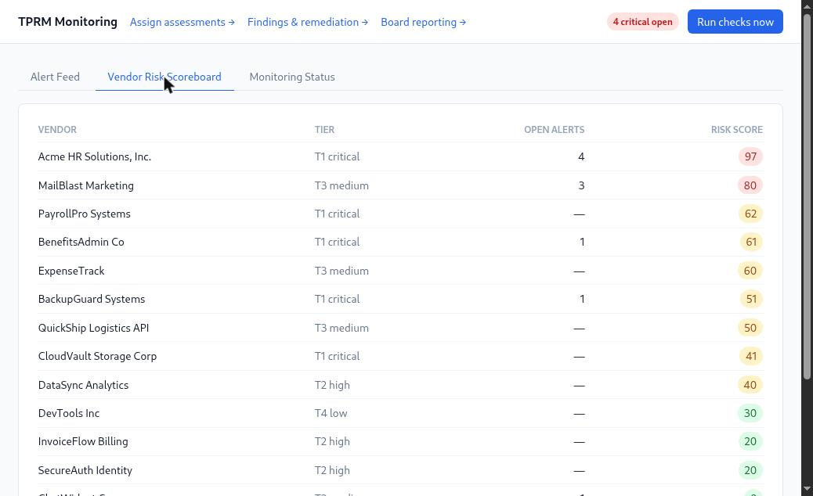
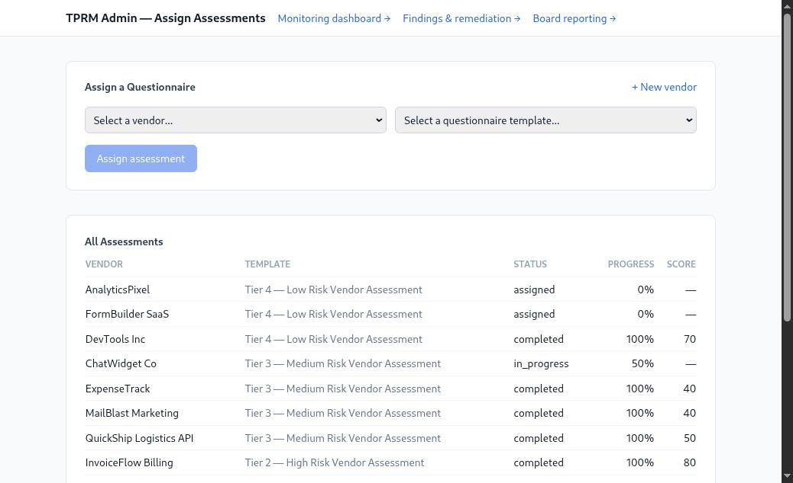

# TPRM Automation Platform


**Replaces the spreadsheet-and-email vendor risk workflow — manual
questionnaires, ad hoc monitoring, remediation tracked in someone's
inbox — with automated scoring, continuous monitoring, and an accountable
remediation trail.** This is the mechanical, ~1,500-hour/year busywork a
Fortune 500 GRC team burns on vendor risk, automated end to end; not a toy
CRUD demo.

Every capability below is fully implemented and tested against a live
PostgreSQL instance — see [Running it](#running-it) to try it yourself, or
[For Evaluators](#for-evaluators) for the fastest path to what matters.

```
Vendor intake & assessment  ->  Continuous monitoring  ->  Remediation workflow
                                        |
                    Contracts / control mapping / playbooks / board reporting
                                        |
                    Security, access control & production hardening
```

## Why this exists

Vendor risk management at scale is a spreadsheet-and-email problem dressed
up as a security program: hundreds of vendors, annual questionnaires
nobody enjoys reading, certifications that quietly expire, and findings
that get "remediated" with a promise instead of evidence. This platform
automates the mechanical parts — scoring, tracking, escalating,
cross-referencing a contract against an assessment — so the humans spend
their time on the parts that actually need judgment: is this vendor's
excuse for missing MFA acceptable, is this evidence real.

## This is not a demo

- **Real state machine, not a status flag**: `rejected` isn't a dead
  end — it's a "revise and resubmit" state with the reviewer's reason
  shown inline to the vendor and tracked in the audit trail, exactly like
  a real compliance workflow. See
  [state-machine.md](docs/remediation/state-machine.md).
- **Evidence-weighted scoring, findings-gated risk changes**: a vendor's
  self-reported answer alone never moves a risk score — only a
  human-reviewed finding closing (or a monitoring alert) does. See the
  [threat model](docs/architecture/threat-model.md) for why that's
  load-bearing, not incidental.
- **Cross-framework control mapping, not four separate questionnaires**:
  one NIST-framed assessment credits toward SOC 2 / ISO 27001 / HIPAA
  coverage by walking a seeded control graph. See
  [control-mapping-guide.md](docs/advanced/control-mapping-guide.md).
- **Integration tests run against a live PostgreSQL instance** — not
  mocked data, not assertions on dummy strings — including a SQL-injection
  regression test that posts a `DROP TABLE` payload and verifies it's
  stored as literal data, never executed.

## How it works (user view)



## Architecture

Full design — system diagram, data flow, scalability/failover posture,
failure points — lives in [`docs/architecture/architecture.md`](docs/architecture/architecture.md).
Supporting docs from the same design pass:

- [`data model`](backend/db/schema/schema.sql) — full PostgreSQL schema (25 tables), executable; validated against a live Postgres 18 instance
- [`integration points`](docs/architecture/integrations.md) — every external API, auth, rate limits, fallback behavior, cost, data sensitivity
- [`threat model`](docs/architecture/threat-model.md) — RBAC, encryption, audit-log immutability, vendor data isolation, third-party-compromise blast radius
- [`tech stack rationale`](docs/architecture/tech-stack.md) — why FastAPI/Postgres/Airflow/Claude/React, and what was rejected
- [`scenario walkthrough`](docs/architecture/scenario-vendor-ransomware.md) — a healthcare vendor ransomware incident traced through every layer, minute by minute

## Screenshots

Vendor portal:

| Assessment result | Findings & remediation |
|---|---|
|  |  |
| Compliance score, risk gauge, per-control breakdown — driven by the mock LLM's evidence-aware scoring. | Auto-generated from assessment gaps and monitoring alerts, one card per finding. |

| Remediation plan submission |
|---|
|  |
| Acknowledge → submit plan → evidence review, the state machine diagrammed above. |

Admin / compliance-team side, seeded with a 16-vendor demo portfolio (`backend/db/seed_demo_portfolio.py`):

| Board reporting | Cross-framework control gaps |
|---|---|
|  |  |
| KPIs across the whole portfolio — findings, MTTR, exception rate, risk bands. | NIST CSF 2.0 / SOC 2 / ISO 27001 / HIPAA gaps in one table, walking the control-mapping graph. |

| Per-vendor framework coverage | Continuous monitoring alerts |
|---|---|
|  |  |
| A single NIST-framed assessment credited across SOC 2/ISO/HIPAA too. | Real alerts from the mock cert/breach/news/financial providers, with risk-score deltas. |

| Vendor risk scoreboard | Assessment pipeline |
|---|---|
|  |  |
| Every vendor, tier, open-alert count, and current risk score, color-coded. | Assigned / in-progress / completed, across all four tiers at once. |

## Capabilities

### Risk Assessment & Scoring

- **Vendor portal** (React + Tailwind): passwordless magic-link login,
  tiered questionnaire (Tier 1–4) with section navigation, autosaved
  answers, drag-and-drop evidence upload, conditional follow-up questions,
  and a results page with a risk gauge and a downloadable PDF report.
- **LLM answer analysis**: classifies each response (Strong/Adequate/Weak/
  Missing/Contradictory), extracts key claims, and flags follow-ups —
  `mock` by default (deterministic, offline, free) or `live` against the
  real Claude API. The mock provider implements a real SOC 2 Type I/II
  contradiction scenario (vendor claims Type II, uploads a Type I report)
  as a tested code path, not just a paragraph in a doc.
- **Automated risk scoring**: per-control and per-framework aggregation,
  evidence-weighted, rolling up to a vendor risk score — every score is
  traceable back to the specific responses and findings that produced it.
- **Admin screen** (`/admin`): create a vendor, assign a questionnaire
  tier, see all assessments in flight.
- Enforces the platform's vendor-isolation guarantee at the API layer
  (cross-vendor access → 404, not 403, so a probing vendor can't even
  confirm another vendor's resource exists) — covered by an integration
  test.

Question counts are a representative subset per tier (150/100/50/20 at
full scale) — the template/question data model supports scaling to the
full count by adding rows, not by changing code; see
[`seed_templates.py`](backend/app/seed/seed_templates.py).

### Continuous Monitoring & Alerting

- **Continuous monitoring** across four source categories — certification
  registries, breach/CVE feeds, news/reputation, financial distress — each
  behind a `mock`/`live` provider interface (see
  [`adding-a-data-source.md`](docs/monitoring/adding-a-data-source.md)).
  Two live providers are genuinely network-tested against real, free,
  keyless APIs (NVD for CVEs, SEC EDGAR full-text search for financial
  distress); the rest are correctly implemented against their documented
  request/response shapes but need a paid/registered key this build
  doesn't have — see `live_providers.py`'s docstring for exactly which.
- **Alert engine**: deduplication (one open alert per vendor+type),
  suppression (with a 90-day expiry and an audit trail), evidence-weighted
  risk-score deltas, and role-based routing (critical → CISO + Compliance
  + Category Manager + Legal; medium → Compliance only) — see
  [`alert-routing.md`](docs/monitoring/alert-routing.md) for the full
  pipeline diagram and real payload examples. This same engine is reused
  by contract-compliance checking below rather than duplicated.
- **Incident impact assessment**: a critical breach alert automatically
  queries which business units/data types are affected and opens a
  critical `findings` row with that context — see
  [`incident-response-playbook-vendor-breach.md`](docs/monitoring/incident-response-playbook-vendor-breach.md)
  for exactly which steps are automated vs. still manual.
- **Escalation**: unacknowledged critical/high alerts auto-escalate past
  their SLA (60 / 240 minutes) and notify the CISO directly.
- **Monitoring dashboard** (`/admin/monitoring`): live alert feed with
  acknowledge/resolve/suppress actions, a vendor risk scoreboard, and a
  data-source health panel — plus a "Run checks now" button, since the
  scheduler that would otherwise trigger this isn't running in this
  environment (see [infrastructure-as-code](#infra-as-code) below).
- One demo vendor (`primary_domain` matching `acmehr-demo.example.com`,
  which is exactly what `seed_demo_data.py` creates) deterministically
  reproduces the ransomware scenario from the architecture walkthrough
  across all four sources when you run the checks — same story, now
  actually executable.

### Remediation & Exception Tracking

- **Finding generation, two triggers**: a completed assessment's weak/
  missing/contradictory responses become findings automatically (severity
  and due-date tiered — critical: 30 days, high: 60, medium: 90, low:
  120); a critical/high monitoring alert opens one too (breach alerts get
  the richer impact-assessment treatment above, cert/CVE/financial ones
  get a direct finding). See
  [`finding_generator.py`](backend/app/services/remediation/finding_generator.py).
- **Remediation state machine**: `new → assigned → in_progress → submitted
  → validating → closed`, with `rejected` as a real, visible "send it back
  for revision" state reachable from either a non-credible plan or
  insufficient evidence — see
  [`state-machine.md`](docs/remediation/state-machine.md) for the full
  diagram and the reasoning behind that design choice.
- **LLM-powered plan and evidence review**: does the vendor's remediation
  plan name concrete actions and a timeline, or is it vague hand-waving?
  Does the uploaded evidence actually prove the fix, or is it (a real
  scenario this handles) a screenshot of one account claiming org-wide
  MFA? See
  [`evidence-validation-guide.md`](docs/remediation/evidence-validation-guide.md).
- **Escalation & accountability**: unacknowledged findings get a daily
  reminder; overdue findings notify category management; findings overdue
  14+ days escalate to Legal (once, tracked via the audit trail so it
  doesn't re-fire daily); repeated rejected submissions flag for
  compliance review.
- **Exceptions**: a vendor who can't remediate requests one with a
  justification and compensating controls; compliance approves it, which
  formally accepts the risk (a *partial* risk-score reduction, not a full
  one — the gap is still there, just knowingly tolerated, and the
  approval is recorded against the specific approving user).
- **Vendor self-service** (`/findings`): view assigned findings, submit a
  plan, upload evidence, message the compliance team, request an
  exception — all with inline feedback from the LLM review, not a black
  box that just says "rejected."
- **Compliance dashboard** (`/admin/findings`): all findings with
  filters, vendor performance (closure rate, overdue count), pending
  exceptions, and KPI cards (MTTR by severity, rework rate, evidence
  coverage) — see
  [`remediation-playbook.md`](docs/remediation/remediation-playbook.md)
  for a realistic 90-day scenario walked through against these exact
  endpoints.

### Compliance & Audit Readiness

- **Contract parsing** (`/admin/contracts`): upload a contract (PDF or
  `.txt`), extract SLA/uptime, breach-notification SLA, named security
  requirements, audit rights, liability, indemnification, and termination/
  renewal terms — same mock/live provider split as every other LLM-backed
  feature. The mock provider uses targeted regexes against real contract
  language, not toy strings — see
  [`contract-compliance.md`](docs/advanced/contract-compliance.md), which
  also documents a real bug (numbered section headings matching before the
  actual clause) found and fixed while smoke-testing this against an
  actual sample contract.
- **Contract obligation tracking & compliance checking**: each extracted
  requirement becomes a trackable `contract_obligations` row; checking
  compliance reuses the monitoring alert engine outright
  (`contract_violation` had been sitting unused in the schema's
  `alert_type` enum since day one) rather than building a parallel
  notification path.
- **Cross-framework control mapping** (`/admin/board` → Vendor Coverage
  tab): "vendor covers 85% of NIST CSF, 78% of SOC 2" made real — a
  vendor's assessment answers are credited across frameworks by walking a
  seeded `control_mappings` graph, so one NIST-framed questionnaire
  implies SOC 2/ISO 27001/HIPAA coverage too. Includes a HIPAA
  gap-analysis scenario ("SOC 2 certified ≠ HIPAA compliant — here's
  exactly what's missing") and a control-gap scorecard across the whole
  vendor base. See
  [`control-mapping-guide.md`](docs/advanced/control-mapping-guide.md).
- **Generalized playbook engine**: `playbook_definitions` rows (5 seeded)
  each name a trigger and an ordered step sequence, executed and logged to
  `playbook_executions` by one small interpreter — deliberately additive
  to the already-tested hardcoded monitoring/remediation logic above,
  covering only the steps nothing else handles yet (e.g. scheduling the
  30-day post-incident review after a breach, which nothing previously
  did). See [`playbook-engine.md`](docs/advanced/playbook-engine.md) for
  exactly what's new per playbook vs. already covered, and how to add a
  sixth.
- **Board reporting dashboard** (`/admin/board`): vendor risk
  distribution, remediation KPIs, top control gaps, upcoming contract
  renewals, and a live playbook-execution log — one consolidated view
  spanning every capability above, matching a realistic healthcare-org
  quarterly board scenario.

### Security, Access Control & Production Hardening

- **Real per-role staff auth**: magic-link staff login (`/staff/auth`)
  issues a session JWT carrying the user's role from `users.role`, and
  `require_role(...)` is a genuine authorization dependency, not an
  `X-Admin-Key` shared-secret placeholder. One endpoint (exception
  approval) is migrated as a proven, fully-tested pattern (401 with no
  staff session → 403 with the wrong role → 200 with the right one, and
  the real approver is now recorded instead of `NULL`) — see ["On the
  RBAC retrofit"](docs/operations/security-hardening.md#on-the-rbac-retrofit)
  for why the other ~30 admin endpoints weren't all retrofitted in this
  pass, and the migration path this establishes for doing so.
- **Real security middleware**: HTTP security headers (HSTS, X-Frame-
  Options, etc.) and a token-bucket rate limiter (120 req/min default) —
  both genuinely tested, including a live demonstration that the limiter
  enforces its exact configured threshold under real concurrent load (120
  succeeded, 80 correctly 429'd out of 200 requests — see below).
- **Dependency vulnerabilities: found and fixed, not just scanned.**
  `pip-audit` initially found 50 known CVEs across 6 packages; every one
  was upgraded to a patched version (`fastapi` 0.115→0.141, `starlette`
  transitively, `pyjwt`, `python-multipart`, `pypdf`, `python-dotenv`),
  with the full 81-test suite re-run after each upgrade to catch
  regressions empirically. **Result: 0 known vulnerabilities**, in both
  `pip-audit` and `npm audit`.
- **Secrets scanning**: a `detect-secrets` baseline, audited (the two
  findings are the same documented dev-only placeholder DB URL, marked
  reviewed) and wired into CI to fail on any *new*, un-audited secret.
- **Real `/health/ready`** (actual DB connectivity check, not a static
  200), `/health/live`, and a Prometheus `/metrics` endpoint (request
  count/latency histograms, DB pool gauges) — all verified live, not
  just written.
- **A load test that was actually run** against the live backend:
  `/health/ready` handled 500 concurrent requests at 1,342 req/s with
  p99 latency of 83ms; a rate-limited admin endpoint correctly allowed
  exactly 120 requests through and rejected the rest with 429 — see
  [`testing-strategy.md`](docs/operations/testing-strategy.md) for the
  full numbers and what they don't prove (single-instance, local Postgres
  — a smoke baseline, not a capacity plan).
- **A backup/restore cycle that was actually run**: `pg_dump`/`pg_restore`
  against a live instance with real accumulated data, verifying not just
  row counts but that the `audit_logs` append-only trigger survived the
  round-trip — see
  [`disaster-recovery.md`](docs/operations/disaster-recovery.md).
- **A real coverage number**: 77% (not an aspirational number restated as
  fact), with an honest breakdown of what's driving the gap (seed scripts
  at 0% but otherwise verified; router HTTP-layer glue thinner than the
  service logic underneath it).

<a id="infra-as-code"></a>
### Operations, Documentation & Infrastructure-as-Code

- **10 operational runbooks** tied to this system's actual code/metrics/
  config, not generic infra filler — plus a security-hardening checklist,
  monitoring/observability guide, disaster-recovery plan, four user
  guides (admin/compliance-officer/vendor/API), four training-session
  outlines, a production launch checklist, and a retrospective template —
  all under [`docs/operations/`](docs/operations/), [`docs/guides/`](docs/guides/),
  and [`docs/training/`](docs/training/).
- **Infrastructure-as-code — written, not executed here.** Four Airflow
  DAGs (`daily_certification_check`, `hourly_breach_check`,
  `daily_news_monitoring`, `weekly_financial_check`, plus a
  `daily_finding_escalation_check`), CI/CD (`.github/workflows/`), both
  Dockerfiles, `docker-compose.yml`, `k8s/`, and `terraform/` are all
  real, valid configuration — every DAG task is a thin wrapper calling
  straight into the service layer that *is* tested (unit + live-Postgres
  integration), every YAML file is `pyyaml`-validated. None of it was
  actually run: no Docker/kubectl/terraform binary or Airflow install was
  available in this sandbox, and applying real cloud infrastructure isn't
  something to do without a live account and explicit authorization
  regardless. Each directory has its own README section on exactly what
  wasn't run and how to actually run it — see
  [`backend/airflow_dags/README.md`](backend/airflow_dags/README.md) and
  [`k8s/README.md`](k8s/README.md) as the starting points.

## Key Design Decisions

1. **Monitoring sources can *create* alerts, but only findings can change
   a risk score.**
   - Why: a scraped certificate-expiry alert shouldn't be able to
     silently move a vendor's risk score on its own — a human has to turn
     it into a reviewed finding first.
   - Consequence: more human touch per incident, but every risk-score
     change is attributable to a specific, auditable finding. See the
     [threat model](docs/architecture/threat-model.md).

2. **One NIST-framed assessment credits across SOC 2 / ISO 27001 / HIPAA
   via a control graph.**
   - Why: vendors legitimately ask "do I really need four separate
     questionnaires that ask the same thing four different ways?"
   - Consequence: the control-mapping graph has to be kept in sync as
     frameworks evolve — it's seeded data, not hardcoded logic, so it can
     be updated without a deploy, but it does need an owner. See
     [control-mapping-guide.md](docs/advanced/control-mapping-guide.md).

3. **`rejected` is a real state, not a dead end.**
   - Why: compliance needs to say "this evidence doesn't prove the fix,
     try again" *and have that exchange tracked*, not just silently email
     the vendor back.
   - Consequence: the vendor-facing UI shows the rejection reason and
     LLM-review feedback inline, and a resubmission loop is a first-class
     part of the state machine, not a workaround. See
     [state-machine.md](docs/remediation/state-machine.md).

See also [tech-stack.md](docs/architecture/tech-stack.md) for the
Postgres/FastAPI/mock-provider choices and what was rejected.

## Known Limitations

- **No historical risk trends.** The board dashboard reports the
  *current* risk distribution, not a before/after trend — "risk improved
  this quarter" isn't something this build can show yet. Needs a
  `risk_score_history` snapshot table. See `reporting.py`'s module
  docstring.
- **Playbook engine is additive, not universal.** 5 seeded playbooks
  cover the gaps nothing else already handled (e.g. scheduling a
  post-incident review); most admin endpoints still run on the hardcoded
  logic from earlier in the build, not a generalized playbook. See
  [playbook-engine.md](docs/advanced/playbook-engine.md) for exactly
  what's covered and how to add a sixth.
- **Two of four monitoring providers are mock-only in this environment.**
  NVD (CVEs) and SEC EDGAR (financial distress) are genuinely
  network-tested against real, free, keyless APIs; the certification-
  registry and breach/news providers are correctly implemented against
  their documented shapes but need a paid/registered key this build
  doesn't have. See [integrations.md](docs/architecture/integrations.md).
- **RBAC is partially migrated.** Exception approval is fully real —
  role-gated, the approving user recorded in the audit trail — as a
  proven pattern; the rest of the admin endpoints still sit behind the
  shared `X-Admin-Key` from earlier in the build. See ["On the RBAC
  retrofit"](docs/operations/security-hardening.md#on-the-rbac-retrofit)
  for the reasoning and the migration path this establishes.
- **No real cloud deployment.** Docker/Kubernetes/Terraform/CI-CD are
  written and validated but never actually run against real
  infrastructure in this environment — see
  [Infrastructure-as-code](#infra-as-code) above.

## For Evaluators

If you're reviewing this for a GRC, compliance, or risk-engineering role,
these are the highest-signal places to look:

- **[Threat model](docs/architecture/threat-model.md)** — vendor data
  isolation, audit-log immutability, and the findings-vs-alert
  distinction that prevents risk-score creep.
- **[Remediation state machine](docs/remediation/state-machine.md)** —
  why `rejected` is a real, tracked state instead of a vendor going quiet
  on an email thread.
- **[Testing strategy](docs/operations/testing-strategy.md)** — 81 tests,
  77% coverage with an honest breakdown of what's and isn't covered, plus
  a load test and a backup/restore cycle that were actually run, not just
  documented.
- **[Control mapping guide](docs/advanced/control-mapping-guide.md)** —
  how one questionnaire credits across four frameworks without
  duplicating hundreds of questions.
- **[Production launch checklist](docs/operations/production-launch-checklist.md)**
  — what "production-ready" actually means for a compliance tool (RBAC,
  rate limits, backup/restore, secrets scanning, dependency audits), with
  each item honestly marked done or not-done for this specific build.

## Running it

### Quick start (5 minutes)

```bash
cd backend
python3 -m venv venv && source venv/bin/activate
pip install -r requirements.txt && cp .env.example .env
createdb tprm && python db/init_db.py && python db/seed_demo_data.py
uvicorn app.main:app --reload        # open the login URL it prints
```
```bash
# in another terminal
cd frontend && npm install && npm run dev   # http://localhost:5173
```

That's a working vendor portal end to end. Requires Python 3.11+, Node
20+, and a local PostgreSQL 15+ your user can create databases on. For
the admin/monitoring/board side, tests, and everything else, keep
reading.

### Full setup & feature tour

Once the backend is running, `python db/seed_demo_portfolio.py` adds a
~15-vendor demo portfolio (all four tiers, varying assessment quality and
pipeline stage) on top of the single demo vendor above — useful for seeing
the board/monitoring/control-gap dashboards with more than one vendor in
them (the screenshots above were taken against this seeded portfolio).

Open the login URL `seed_demo_data.py` printed to walk through the
questionnaire as the demo vendor, or open `/admin` (key from
`ADMIN_API_KEY` in `.env`, default `dev-admin-key`) to assign a fresh one.
Completing that assessment auto-generates findings you can then work
through at `/findings` as the vendor. Open `/admin/monitoring` and click
**Run checks now** to see the demo vendor's alerts, risk score, and
auto-created incident finding appear live — that button runs exactly what
the Airflow DAGs would run on a schedule, and also fires the matching
playbooks. `/admin/findings` is the compliance-side view: all findings,
vendor performance, pending exceptions, and KPIs. `/admin/contracts` lets
you upload a contract for that vendor and check it for compliance;
`/admin/board` is the consolidated board-reporting view (KPIs, control
gaps, contract renewals, playbook execution log, and per-vendor framework
coverage).

External monitoring integrations (HIBP, NewsAPI, D&B, and the cert
registries) default to `mock` providers so the platform runs fully offline
with zero paid API keys — see
[`integrations.md`](docs/architecture/integrations.md) for how to swap in
real ones. `LLM_PROVIDER` and `EMAIL_PROVIDER` follow the same pattern
(see `backend/.env.example`).

Once running, `/docs` (Swagger UI) and `/metrics` (Prometheus format) are
live on the backend — see [`api-guide.md`](docs/guides/api-guide.md) and
[`monitoring-observability.md`](docs/operations/monitoring-observability.md).
Staff (internal) accounts can sign in the same magic-link way at
`/staff/auth/request-link` — seeded demo accounts:
`ciso@example.com`, `compliance@example.com`, `category-manager@example.com`,
`legal@example.com` (see `app/seed/seed_users.py`).

**Tests**
```bash
cd backend && source venv/bin/activate
pip install -r requirements-dev.txt
pytest --cov=app --cov-report=term-missing   # 81 tests, 77% coverage
```
Two of those tests (`test_live_providers_network.py`) call the real NVD
and SEC EDGAR APIs and skip themselves automatically if the network is
unreachable.

**Security & load-test scripts** (also real, also runnable locally):
```bash
pip-audit -r requirements.txt                              # 0 known vulnerabilities
detect-secrets scan --baseline ../.secrets.baseline          # audited baseline, no new findings
python scripts/load_test.py --endpoint /health/ready --concurrency 50 --requests 500
./scripts/backup_restore.sh backup "$DATABASE_URL" backup.dump
```
