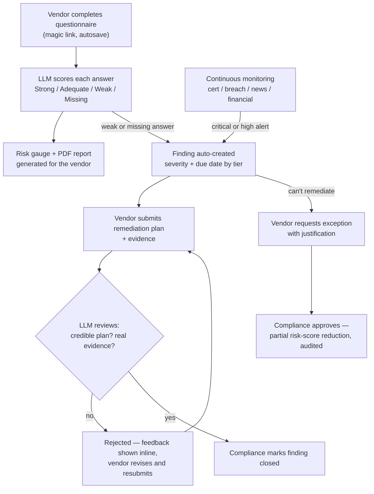

# TPRM Automation Platform


**Vendor risk management platform: assessments → continuous monitoring → remediation.**

Automates the mechanical work of vendor risk (scoring, tracking, escalating,
cross-referencing a contract against an assessment) so a compliance team
spends its time on the parts that actually need judgment — is this
vendor's excuse for missing MFA acceptable, is this evidence real.

- ✅ 81 tests, 77% coverage — against a live PostgreSQL instance, not mocks
- ✅ Real RBAC, rate limiting, and an append-only audit trail — implemented and tested
- ✅ 0 known dependency vulnerabilities (`pip-audit` + `npm audit` passing)
- ✅ Runnable locally in about 5 minutes — see [Quick Start](#quick-start) below

## The Problem This Solves

Vendor risk teams typically track hundreds of vendors by hand:

| Manual task | Spreadsheet-and-email reality | What this platform does |
|---|---|---|
| Vendor intake | Email + manual data entry | Magic-link questionnaire, auto-saves, tiered by vendor criticality |
| Scoring an assessment | A person reads and judges each answer | LLM classification + evidence-weighted scoring |
| Monitoring vendors | Check cert registries monthly, if at all | Scheduled checks — hourly for breaches, daily for certs/news, weekly for financials |
| Tracking findings | Spreadsheet cells and status colors | State machine with role-based escalation and an audit trail |
| Evidence review | "Does this screenshot actually prove it?" | LLM analysis flags weak/unverified claims before a human signs off |
| Reporting to leadership | A pivot table built the night before | Live dashboard: KPIs, current risk distribution, control gaps |
| Contract compliance | A manual checklist, if it exists at all | Parsed contract obligations checked against monitoring alerts |

See [Known Limitations](#known-limitations) for what this honestly doesn't do yet (e.g. no historical risk trending) — not glossed over.

## Quick Start

```bash
git clone https://github.com/DineshMuppidi/tprm-automation.git
cd tprm-automation/backend
python3 -m venv venv && source venv/bin/activate
pip install -r requirements.txt && cp .env.example .env
createdb tprm && python db/init_db.py && python db/seed_demo_data.py
uvicorn app.main:app --reload        # backend on localhost:8000
```
```bash
# in another terminal
cd ../frontend && npm install && npm run dev   # frontend on localhost:5173
```

Open the login URL `seed_demo_data.py` printed to try the vendor side, or
open `/admin` (key `dev-admin-key`) and click **Run checks now** on
`/admin/monitoring` to see alerts, a risk-score change, and an
auto-generated finding appear live. Full walkthrough — staff accounts,
the multi-vendor demo seed, tests, security scripts — in
[Running it](#running-it) below.

## Architecture

**If you're evaluating this for a hiring decision:** read the
[threat model](docs/architecture/threat-model.md) (5 min) — it covers
vendor data isolation, audit-log immutability, and why monitoring alerts
can't unilaterally change a risk score. [Key Design Decisions](#key-design-decisions)
below covers the three biggest architectural bets and their trade-offs.

**If you want the full design:** system diagram, data flow,
scalability/failover posture, and failure points are in
[`docs/architecture/architecture.md`](docs/architecture/architecture.md),
alongside the [data model](backend/db/schema/schema.sql) (25 tables, live-Postgres-validated),
[integration points](docs/architecture/integrations.md),
[tech stack rationale](docs/architecture/tech-stack.md), and a
[scenario walkthrough](docs/architecture/scenario-vendor-ransomware.md)
tracing a healthcare vendor ransomware incident through every layer.

## What It Looks Like

**Vendor side:** answer a questionnaire → see a risk gauge and per-control
breakdown → submit a remediation plan → get evidence feedback.

| Assessment result | Findings & remediation |
|---|---|
|  |  |

| Remediation plan submission |
|---|
|  |

**Admin side:** monitor vendors → review alerts and risk scores → manage
findings → run board reports → check control gaps across frameworks.
(Seeded with a 16-vendor demo portfolio — `backend/db/seed_demo_portfolio.py`.)

| Board reporting | Cross-framework control gaps |
|---|---|
|  |  |

| Per-vendor framework coverage | Continuous monitoring alerts |
|---|---|
|  |  |

| Vendor risk scoreboard | Assessment pipeline |
|---|---|
|  |  |

## How It Works



### 1️⃣ Vendor Intake & Assessment

**What happens:** a vendor gets a magic-link login, answers a tiered
questionnaire (with drag-and-drop evidence upload), and an LLM classifies
each answer (Strong/Adequate/Weak/Missing/Contradictory) before rolling up
into an evidence-weighted risk score.

**What's special:** the mock LLM provider is deterministic — the same
answers always produce the same score — and implements a real SOC 2 Type
I/II contradiction scenario as a tested code path, not a paragraph in a
doc. Vendor isolation is enforced at the API layer (cross-vendor access →
404, not 403, so a probing vendor can't even confirm another vendor's
resource exists). Question counts here are a representative subset per
tier — the data model supports scaling to the spec's full 150/100/50/20
by adding rows, not by changing code.

[`seed_templates.py`](backend/app/seed/seed_templates.py) · [assessment result screenshot above](#what-it-looks-like)

### 2️⃣ Continuous Monitoring

**What happens:** four source categories run on independent schedules —
breaches/CVEs (HIBP + NVD, hourly), certification expiry (daily),
news/reputation (daily), and financial distress (SEC EDGAR, weekly).
Alerts are deduplicated, suppressed (90-day expiry, audited), and routed
by role and severity.

**What's special:** two providers are genuinely network-tested against
real, free, keyless APIs (NVD for CVEs, SEC EDGAR for financial distress);
the rest are correctly implemented against documented request/response
shapes but need a paid/registered key this build doesn't have. The same
alert engine is reused by contract-compliance checking below instead of
being duplicated, and a critical breach automatically opens a
richer, impact-scoped finding (which business units/data types are
affected) rather than a generic one.

[`adding-a-data-source.md`](docs/monitoring/adding-a-data-source.md) · [`alert-routing.md`](docs/monitoring/alert-routing.md)

### 3️⃣ Remediation & Exception Tracking

**What happens:** assessment gaps and monitoring alerts both auto-generate
findings with severity-tiered due dates. A vendor submits a plan and
evidence; an LLM reviews it for credibility before a human closes it.
Overdue findings escalate — daily reminder, then category management,
then Legal at 14+ days.

**What's special:** `rejected` is a real, visible state — not a dead end
— reachable from a non-credible plan or insufficient evidence, with the
resubmission tracked in the audit trail rather than a silent email back
and forth. A vendor who genuinely can't remediate can request an
exception; approval is a *partial* risk-score reduction, not a full one,
and the approving user is recorded.

[`state-machine.md`](docs/remediation/state-machine.md) · [`evidence-validation-guide.md`](docs/remediation/evidence-validation-guide.md) · [`remediation-playbook.md`](docs/remediation/remediation-playbook.md)

### 4️⃣ Contracts & Cross-Framework Compliance

**What happens:** upload a contract (PDF or `.txt`) and extract SLA,
breach-notification terms, security requirements, liability, and
renewal dates as trackable obligations. One NIST-framed assessment
credits toward SOC 2 / ISO 27001 / HIPAA coverage by walking a seeded
control-mapping graph, so a vendor isn't filling out four questionnaires
that ask the same thing four ways.

**What's special:** contract-compliance checking reuses the monitoring
alert engine outright rather than a parallel notification path; the
control graph includes a real HIPAA gap-analysis scenario ("SOC 2
certified ≠ HIPAA compliant — here's exactly what's missing") and a
control-gap scorecard across the whole vendor base. A generalized
playbook engine (5 seeded playbooks) handles the steps nothing else
already covers, like scheduling a 30-day post-incident review.

[`contract-compliance.md`](docs/advanced/contract-compliance.md) · [`control-mapping-guide.md`](docs/advanced/control-mapping-guide.md) · [`playbook-engine.md`](docs/advanced/playbook-engine.md)

### 5️⃣ Board & Executive Reporting

**What happens:** one dashboard (`/admin/board`) consolidates vendor risk
distribution, remediation KPIs, top control gaps, upcoming contract
renewals, and a live playbook-execution log.

**What's special:** it spans every capability above rather than being a
separate reporting layer bolted on afterward — the numbers on the board
are the same numbers the compliance and monitoring dashboards show,
not a re-aggregated copy.

<a id="security-hardening-section"></a>
### 6️⃣ Security, Access Control & Production Hardening

**What happens:** real per-role staff auth (`/staff/auth`, session JWTs
carrying a role claim), HTTP security headers, a token-bucket rate
limiter, Prometheus metrics, and a real `/health/ready` DB check.

**What's special:** `pip-audit` found 50 known CVEs across 6 packages;
every one was upgraded and the full test suite re-run after each step —
**0 known vulnerabilities** today, in both `pip-audit` and `npm audit`.
One endpoint (exception approval) is migrated to real role-based
authorization as a proven pattern (401 → 403 → 200, real approver
recorded); see [Known Limitations](#known-limitations) for why the rest
of the admin surface hasn't been. Docker/Kubernetes/Terraform/CI-CD and
the four Airflow DAGs are written and validated but not executed in this
sandbox — see [`security-hardening.md`](docs/operations/security-hardening.md)
and [`backend/airflow_dags/README.md`](backend/airflow_dags/README.md).

## Production Readiness

| Dimension | Status | Proof |
|---|---|---|
| Testing | 77% coverage | 81 tests, live-PostgreSQL integration |
| Dependency security | 0 known vulnerabilities | `pip-audit` + `npm audit` passing (50 CVEs found and fixed to get here) |
| RBAC | Partial | Exception approval fully role-gated and tested; remaining admin endpoints still on a shared API key — see [Known Limitations](#known-limitations) |
| Rate limiting | Load-tested | 120 req/min enforced under real concurrent load — exactly 120 of 200 requests succeeded, 80 correctly rejected with 429 |
| Audit trail | Append-only | DB trigger rejects UPDATE/DELETE on `audit_logs`; survived a real backup/restore round-trip intact |
| Disaster recovery | Tested | `pg_dump`/`pg_restore` run against a live instance with real data, not a dry run |
| Documentation | Extensive | 10 operational runbooks, threat model, architecture docs, 4 training outlines |

[Full numbers →](docs/operations/testing-strategy.md)

## Key Design Decisions

1. **Monitoring sources can *create* alerts, but only findings can change
   a risk score.**
   - Why: a scraped certificate-expiry alert shouldn't be able to
     silently move a vendor's risk score on its own — a human has to turn
     it into a reviewed finding first.
   - Consequence: more human touch per incident, but every risk-score
     change is attributable to a specific, auditable finding. See the
     [threat model](docs/architecture/threat-model.md).

2. **One NIST-framed assessment credits across SOC 2 / ISO 27001 / HIPAA
   via a control graph.**
   - Why: vendors legitimately ask "do I really need four separate
     questionnaires that ask the same thing four different ways?"
   - Consequence: the control-mapping graph has to be kept in sync as
     frameworks evolve — it's seeded data, not hardcoded logic, so it can
     be updated without a deploy, but it does need an owner. See
     [control-mapping-guide.md](docs/advanced/control-mapping-guide.md).

3. **`rejected` is a real state, not a dead end.**
   - Why: compliance needs to say "this evidence doesn't prove the fix,
     try again" *and have that exchange tracked*, not just silently email
     the vendor back.
   - Consequence: the vendor-facing UI shows the rejection reason and
     LLM-review feedback inline, and a resubmission loop is a first-class
     part of the state machine, not a workaround. See
     [state-machine.md](docs/remediation/state-machine.md).

See also [tech-stack.md](docs/architecture/tech-stack.md) for the
Postgres/FastAPI/mock-provider choices and what was rejected.

## Known Limitations

- **No historical risk trends.** The board dashboard reports the
  *current* risk distribution, not a before/after trend — "risk improved
  this quarter" isn't something this build can show yet. Needs a
  `risk_score_history` snapshot table. See `reporting.py`'s module
  docstring.
- **Playbook engine is additive, not universal.** 5 seeded playbooks
  cover the gaps nothing else already handled (e.g. scheduling a
  post-incident review); most admin endpoints still run on the hardcoded
  logic from earlier in the build, not a generalized playbook. See
  [playbook-engine.md](docs/advanced/playbook-engine.md) for exactly
  what's covered and how to add a sixth.
- **Two of four monitoring providers are mock-only in this environment.**
  NVD (CVEs) and SEC EDGAR (financial distress) are genuinely
  network-tested against real, free, keyless APIs; the certification-
  registry and breach/news providers are correctly implemented against
  their documented shapes but need a paid/registered key this build
  doesn't have. See [integrations.md](docs/architecture/integrations.md).
- **RBAC is partially migrated.** Exception approval is fully real —
  role-gated, the approving user recorded in the audit trail — as a
  proven pattern; the rest of the admin endpoints still sit behind the
  shared `X-Admin-Key` from earlier in the build. See ["On the RBAC
  retrofit"](docs/operations/security-hardening.md#on-the-rbac-retrofit)
  for the reasoning and the migration path this establishes.
- **No real cloud deployment.** Docker/Kubernetes/Terraform/CI-CD are
  written and validated but never actually run against real
  infrastructure in this environment — see
  [Security, Access Control & Production Hardening](#security-hardening-section) above.

## For Evaluators

Pick the angle that matches what you're assessing:

**Hiring for vendor / third-party risk?**
→ [Threat model](docs/architecture/threat-model.md) (5 min) → [state machine](docs/remediation/state-machine.md) (3 min) → [Quick Start](#quick-start) (5 min)

**Hiring for compliance automation broadly?**
→ [Control mapping guide](docs/advanced/control-mapping-guide.md) → [remediation playbook](docs/remediation/remediation-playbook.md)

**Hiring for security / architecture?**
→ [Threat model](docs/architecture/threat-model.md) → [security hardening](docs/operations/security-hardening.md) → [testing strategy](docs/operations/testing-strategy.md)

**Hiring for platform / DevOps?**
→ [Airflow DAGs / infra](backend/airflow_dags/README.md) → [disaster recovery](docs/operations/disaster-recovery.md)

**Everything:** [full architecture →](docs/architecture/architecture.md)

## Running it

Prerequisites: Python 3.11+, Node 20+, PostgreSQL 15+. If you haven't
already, see [Quick Start](#quick-start) above for the fastest path to a
working local instance — the rest of this section is the fuller tour.

Once the backend is running, `python db/seed_demo_portfolio.py` adds a
~15-vendor demo portfolio (all four tiers, varying assessment quality and
pipeline stage) on top of the single demo vendor from Quick Start — useful
for seeing the board/monitoring/control-gap dashboards with more than one
vendor in them (the screenshots above were taken against this seeded
portfolio).

Open the login URL `seed_demo_data.py` printed to walk through the
questionnaire as the demo vendor, or open `/admin` (key from
`ADMIN_API_KEY` in `.env`, default `dev-admin-key`) to assign a fresh one.
Completing that assessment auto-generates findings you can then work
through at `/findings` as the vendor. Open `/admin/monitoring` and click
**Run checks now** to see the demo vendor's alerts, risk score, and
auto-created incident finding appear live — that button runs exactly what
the Airflow DAGs would run on a schedule, and also fires the matching
playbooks. `/admin/findings` is the compliance-side view: all findings,
vendor performance, pending exceptions, and KPIs. `/admin/contracts` lets
you upload a contract for that vendor and check it for compliance;
`/admin/board` is the consolidated board-reporting view.

External monitoring integrations (HIBP, NewsAPI, D&B, and the cert
registries) default to `mock` providers so the platform runs fully offline
with zero paid API keys — see
[`integrations.md`](docs/architecture/integrations.md) for how to swap in
real ones. `LLM_PROVIDER` and `EMAIL_PROVIDER` follow the same pattern
(see `backend/.env.example`).

Once running, `/docs` (Swagger UI) and `/metrics` (Prometheus format) are
live on the backend — see [`api-guide.md`](docs/guides/api-guide.md) and
[`monitoring-observability.md`](docs/operations/monitoring-observability.md).
Staff (internal) accounts can sign in the same magic-link way at
`/staff/auth/request-link` — seeded demo accounts:
`ciso@example.com`, `compliance@example.com`, `category-manager@example.com`,
`legal@example.com` (see `app/seed/seed_users.py`).

**Tests**
```bash
cd backend && source venv/bin/activate
pip install -r requirements-dev.txt
pytest --cov=app --cov-report=term-missing   # 81 tests, 77% coverage
```
Two of those tests (`test_live_providers_network.py`) call the real NVD
and SEC EDGAR APIs and skip themselves automatically if the network is
unreachable.

**Security & load-test scripts** (also real, also runnable locally):
```bash
pip-audit -r requirements.txt                              # 0 known vulnerabilities
detect-secrets scan --baseline ../.secrets.baseline          # audited baseline, no new findings
python scripts/load_test.py --endpoint /health/ready --concurrency 50 --requests 500
./scripts/backup_restore.sh backup "$DATABASE_URL" backup.dump
```
