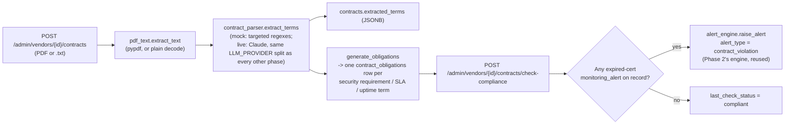

# Contract Compliance Automation

Phase 4 deliverable. Upload a contract, extract its security/compliance
terms, turn them into trackable obligations, and check the vendor's actual
state against them — closing the loop the spec describes in §1.

## Pipeline

## What gets extracted

`sla_uptime_pct`, `incident_notification_sla_hours`, `security_requirements`
(one clause per named requirement — SOC 2/ISO 27001/PCI, encryption,
pentesting, etc.), `audit_rights`, `liability_cap`, `indemnification`,
`termination_notice_days`, `auto_renews`, `renewal_notice_days`. See
[`contract_parser.py`](../../backend/app/services/contracts/contract_parser.py).

**A real bug found and fixed while building this**, worth knowing about if
you extend the mock parser: naively taking "the first sentence containing
the keyword" matches numbered section headings ("5. Liability.") before
the actual clause, since the heading contains the keyword too. The fix
(`_MIN_CLAUSE_WORDS` in `contract_parser.py`) skips anything short enough
to be a heading rather than a real sentence — a five-word-minimum
heuristic, not a robust document-structure parser, so a contract with
unusually terse clauses could still trip it. `test_extracts_audit_and_
liability_clauses` asserts on the substantive clause text specifically so
this can't silently regress.

## What the compliance check actually verifies

Narrow and honest about it: `check_contract_compliance` checks
`certification`-type obligations against whether the vendor currently has
an *expired* (not merely expiring) `cert_expiry` monitoring alert on
record. That's one clear, unambiguous signal — not a general-purpose
contract-compliance engine that reasons about SLA uptime percentages,
notification timing on an actual incident, or liability terms. Extending
it to check `notification_sla` obligations against actual incident
response times, or `sla_uptime` obligations against real uptime data, is
future work — the obligation rows and `contract_obligations.next_check_due`
scheduling are already there to support it, but nothing computes those
checks yet.

## Why this reuses Phase 2's alert engine

A found violation calls `alert_engine.raise_alert(..., alert_type=
"contract_violation", ...)` — the same dedup, suppression, risk-score
delta, and role-based routing every other alert type gets, rather than a
parallel contract-specific notification path. `contract_violation` has
been sitting in the schema's `alert_type` enum since Phase 0, unused until
this is the first code to raise one.
