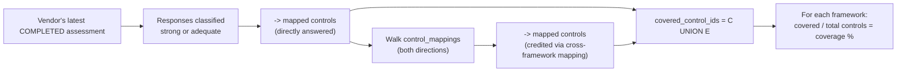

# Control Mapping Guide

Phase 4 deliverable. How
[`frameworks/coverage.py`](../../backend/app/services/frameworks/coverage.py)
turns the Phase 0 control catalog and cross-framework `control_mappings`
graph into the spec's own headline claims — "vendor covers 85% of NIST
CSF, 78% of SOC 2" and "here's exactly what's missing for HIPAA."

## How "coverage" is computed

A control counts as covered if either:
1. A question in the vendor's latest completed assessment maps to it
   directly and scored `adequate` or `strong` (`weak`/`missing`/
   `contradictory` don't count — matching Phase 1's own strictness rule), or
2. It's linked via `control_mappings` to a control covered by (1).

This is what lets a single NIST-CSF-framed questionnaire answer imply
something about a vendor's likely SOC 2 / ISO 27001 / HIPAA posture
without a separate questionnaire per framework — the cross-framework graph
is exactly what does that translation.

## Three ways to query it

| Question | Endpoint | Function |
|---|---|---|
| "What % of each framework does this vendor cover?" | `GET /admin/vendors/{id}/framework-coverage` | `vendor_framework_coverage` |
| "Vendor claims SOC 2 = compliant with HIPAA — what's actually missing?" | `GET /admin/vendors/{id}/framework-gap-analysis?target_framework=HIPAA` | `framework_gap_analysis` |
| "Show me every control related to encryption" | `GET /admin/controls/{id}/related` | `related_controls` |
| "Across all vendors, which controls have the biggest critical-tier gaps?" | `GET /admin/reporting/control-gaps` | `control_coverage_scorecard` |

The second one is the spec's own HIPAA scenario made literal: a vendor
saying "we're SOC 2 certified" doesn't answer "compliant with what,
specifically" — `framework_gap_analysis` walks the same mapping graph in
the other direction and returns the HIPAA controls that mapping *doesn't*
reach, which is exactly the "HIPAA-specific risk assessment, breach
notification SLA, workforce training on PHI" gap list the spec describes.

## Extending the control catalog

Nothing about coverage/gap/related-controls logic changes when the
catalog grows — `control_coverage_scorecard` and friends just iterate
whatever's in `controls`/`control_mappings`. Adding a framework or control:

1. Add rows to `FRAMEWORKS` / `CONTROLS` in
   [`seed_frameworks.py`](../../backend/app/seed/seed_frameworks.py)
   (Phase 0's seed script — frameworks aren't Phase-4-specific).
2. Add `CONTROL_MAPPINGS` entries linking the new control to existing ones,
   with a `confidence` (0-1) and a one-line `rationale` — these show up
   directly in `related_controls` output, so write the rationale for the
   next compliance officer reading the API response, not just for
   yourself.
3. Re-run `db/init_db.py` (idempotent, `ON CONFLICT DO UPDATE`).

## Known limitation

Coverage is computed from the vendor's **most recent completed**
assessment only — an `in_progress` reassessment is ignored entirely until
it's submitted, even if it would show improved coverage; the numbers stay
pinned to the last completed snapshot. A vendor with no completed
assessment at all shows 0% coverage everywhere (verified behavior, see
`test_vendor_with_no_assessment_has_zero_coverage`) rather than an error —
an honest zero, not a crash, for the common case of a vendor that's just
been onboarded.
