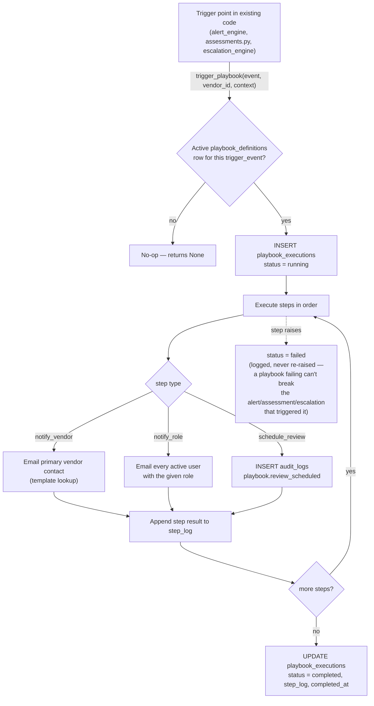

# Playbook Engine

Phase 4 deliverable. The generalized, templated playbook system the spec
calls for — `playbook_definitions` rows (seeded, not hardcoded) each name
a `trigger_event` and an ordered list of `steps`; firing one is a single
call to
[`playbook_engine.trigger_playbook`](../../backend/app/services/playbooks/playbook_engine.py).

## Why five playbooks, and why they're each so short

Phases 2 and 3 already implement most of what the spec's five playbook
scenarios describe — as hardcoded, tested Python, not through a template
interpreter, because generalizing an abstraction from a sample size of one
(or building the generalization *before* two real cases exist to compare)
tends to produce the wrong abstraction. Each seeded playbook below is
scoped to *only* the steps nothing else already covers — see
[`seed_playbooks.py`](../../backend/app/seed/seed_playbooks.py) for the
exact reasoning per playbook.

| Playbook | Trigger | New steps (not already handled elsewhere) |
|---|---|---|
| `vendor_breach_response` | `alert.breach.critical` | Schedule the 30-day post-incident review |
| `cert_critical_expiring` | `alert.cert_expiry.critical` | Email the vendor a renewal request; schedule a 14-day internal follow-up |
| `vendor_fails_critical_assessment` | `assessment.completed.risk_critical` | Entirely new: notify CISO + Compliance, schedule a business-continuity review |
| `vendor_financial_distress` | `alert.financial_distress.high` | Category-manager-specific business-continuity nudge |
| `remediation_deadline_missed` | `finding.legal_escalated` | Vendor-facing final notice email |

## Flow

## Creating a new playbook

1. **Decide the trigger event string.** Match the pattern already in use:
   `{domain}.{event}.{qualifier}` (e.g. `alert.cve.critical`,
   `finding.overdue.30d`). It's just a lookup key — nothing enforces the
   format, but consistency helps the next person find it.
2. **Add a row to `PLAYBOOKS` in `seed_playbooks.py`** — `code`, `name`,
   `trigger_event`, and an ordered list of step dicts using the three
   existing step types (`notify_vendor`, `notify_role`, `schedule_review`).
   Re-run `db/init_db.py` — the seed is idempotent (`ON CONFLICT (code) DO
   UPDATE`).
3. **If a step needs a new email template**, add it to
   `VENDOR_EMAIL_TEMPLATES` or `ROLE_MESSAGE_TEMPLATES` in
   `playbook_engine.py`. If you need an entirely new *step type* (e.g.
   `create_ticket_in_external_system`), add a branch to `_execute_step` —
   it's a single function, not a plugin registry, because five step types
   across five playbooks doesn't yet justify one.
4. **Call `trigger_playbook`** from wherever the triggering event actually
   happens — see the four call sites in `monitoring_service.py`,
   `assessments.py`, and `escalation_engine.py` for the pattern (always
   inside the same transaction as the event itself, always passing
   `alert_id` or `finding_id` when one exists so `playbook_executions`
   stays traceable back to what caused it).
5. **Test it directly**, the same way `test_playbooks.py` does: call
   `trigger_playbook` with a real `conn` and assert on the returned
   execution's `step_log` — no need to go through the full alert/assessment
   pipeline just to verify a playbook's own step sequence.
