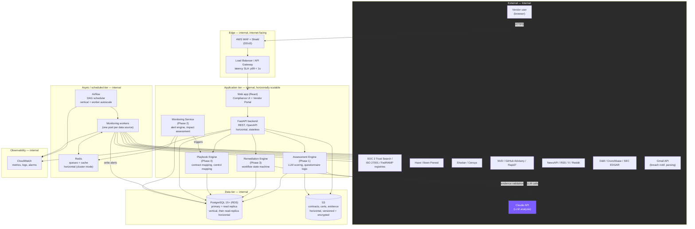

# TPRM Automation Platform — System Architecture

Phase 0 deliverable. This document defines the system boundary, data flow,
scalability posture, and failure points for the platform described in
`README.md`. It is the foundation Phases 1–5 build against — application
code should not introduce a component that isn't represented here.

## 1. System Architecture

**Internal vs. external.** Everything inside `EDGE`, `APP`, `ASYNC`, `DATA`,
and `OBS` is internal infrastructure we operate. `EXT` is third-party —
we do not control its uptime, and every arrow crossing that boundary must
have a documented fallback (see §3, Integration Points).

**Scalability.**
| Component | Strategy | Notes |
|---|---|---|
| FastAPI backend | Horizontal | Stateless; scale by request volume behind ALB |
| Airflow scheduler | Vertical | Single scheduler is a bottleneck by design; workers scale horizontally |
| Monitoring workers | Horizontal (per source) | Each data source gets its own worker pool so a slow API (D&B) never blocks a fast one (NVD) |
| PostgreSQL | Vertical first, then read replicas | Writes stay single-primary for audit-log integrity; reporting queries hit replicas |
| Redis | Horizontal (cluster mode) | Queue depth is the early-warning signal for backpressure |
| S3 | Horizontal (inherent) | No action needed |

**Latency SLA.** API p99 < 1s (per Phase 5 monitoring target). Assessment
LLM scoring target < 5s per response (async, not on the request path —
vendor sees "analyzing..." and the UI polls/streams the result).

**Failover.** ALB health-checks the API tier and drains unhealthy nodes.
PostgreSQL uses RDS Multi-AZ automatic failover (target RTO 15 min, see
Phase 5 disaster recovery). Airflow DAGs use per-task retry with exponential
backoff (3 retries) rather than instance failover — a missed monitoring run
is recoverable, a stuck one isn't.

**Failure points worth naming explicitly:**
1. **Claude API outage** — assessment scoring and evidence validation both
   depend on it. Mitigation: queue requests in Redis, retry with backoff;
   surface "pending analysis" state in the UI rather than blocking vendor
   submission. Air-gapped deployments fall back to a local Llama 3.2
   instance with a reduced prompt set (see Tech Stack doc, §LLM).
2. **A single monitoring source going down** (e.g., HIBP) — must not stop
   the other DAGs. Each source has its own DAG, its own retry policy, and
   its own row in `monitoring_sources` with health status shown on the
   dashboard (Phase 2, Monitoring Status Page).
3. **Airflow scheduler itself down** — no new DAG runs fire, but the API
   and existing data are unaffected; this is a "stale monitoring data"
   degradation, not an outage, and is what Runbook 3 (Phase 5) exists for.
4. **PostgreSQL primary down** — the whole write path stops; this is the
   only true single point of failure in the design, which is why it gets
   Multi-AZ failover and the tightest RTO in the platform.

## 2. Data Model

See [`backend/db/schema/schema.sql`](../../backend/db/schema/schema.sql) —
executable, PostgreSQL 15+, validated against a live Postgres 18 instance
during Phase 0. Covers: vendor profiles, questionnaire templates/assessments,
findings/remediation, contracts/obligations, framework/control mapping,
monitoring alerts, and an append-only audit log (enforced by trigger, not
just convention).

## 3. Integration Points

See [`integrations.md`](integrations.md).

## 4. Threat Model

See [`threat-model.md`](threat-model.md).

## 5. Real-World Scenario Walkthrough

See [`scenario-vendor-ransomware.md`](scenario-vendor-ransomware.md).

## 6. Technology Stack

See [`tech-stack.md`](tech-stack.md).
