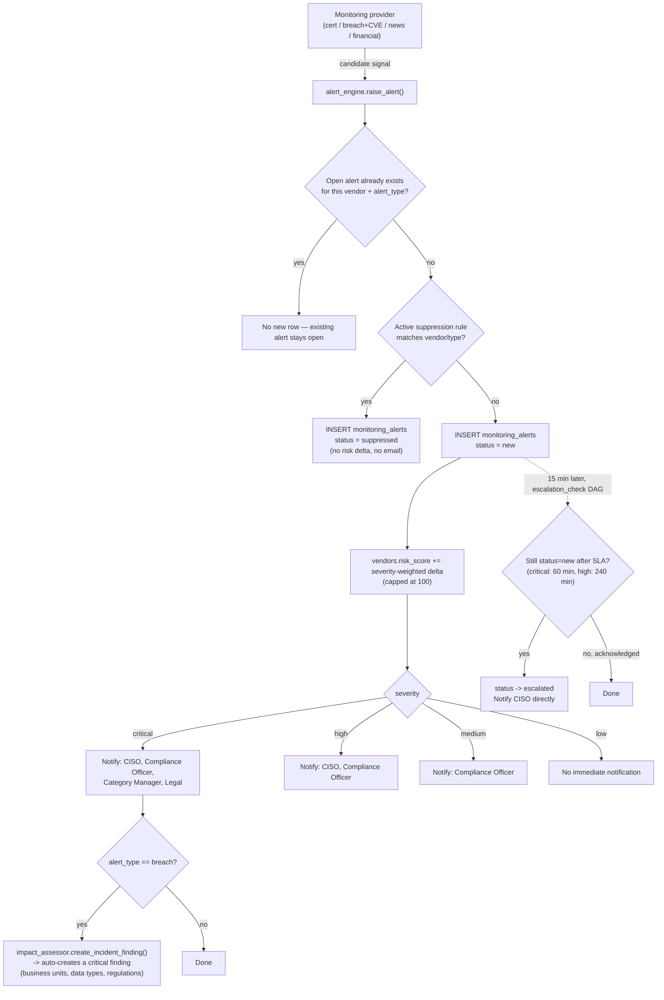

# Alert Routing & Escalation

Phase 2 deliverable — how a raw signal from a monitoring source becomes a
persisted alert, gets routed, and (if nobody acknowledges it in time)
escalates. Implemented in
[`app/services/monitoring/alert_engine.py`](../../backend/app/services/monitoring/alert_engine.py).

## Flow



## Alert payload examples

These are the actual JSON stored in `monitoring_alerts.payload`, produced
by the mock providers reproducing the ransomware scenario from
[`docs/architecture/scenario-vendor-ransomware.md`](../architecture/scenario-vendor-ransomware.md)
end to end.

**CRITICAL — breach** (triggers `impact_assessor.create_incident_finding`):
```json
{
  "alert_type": "breach",
  "severity": "critical",
  "title": "Acme HR Solutions, Inc. discloses ransomware incident affecting customer records",
  "payload": {
    "source": "mock:dark-web-monitoring + press coverage",
    "attack_type": "ransomware",
    "estimated_records_affected": 50000,
    "data_types_involved": ["employee_pii", "compensation_data"]
  },
  "risk_score_delta": 25.0
}
```

**CRITICAL — certification expiring** (matches the Phase 2 spec's own
worked example verbatim — same auditor, same 21-day window):
```json
{
  "alert_type": "cert_expiry",
  "severity": "critical",
  "title": "SOC 2 Type II expiring soon",
  "payload": {
    "certificate_type": "SOC 2 Type II",
    "status": "expiring_soon",
    "expiration_date": "2026-09-15",
    "days_until_expiry": 21,
    "auditor": "Big4 Audit Firm"
  },
  "risk_score_delta": 10.0
}
```

**MEDIUM — negative news**:
```json
{
  "alert_type": "news_reputation",
  "severity": "medium",
  "title": "Acme HR Solutions, Inc. ransomware attack draws regulatory scrutiny",
  "payload": {
    "sentiment": "negative",
    "story_type": "breach",
    "source_url": "https://example-news.test/acme-hr-ransomware",
    "summary": "Coverage of the disclosed ransomware incident and its impact on customers."
  },
  "risk_score_delta": 5.0
}
```

**MEDIUM — financial distress**:
```json
{
  "alert_type": "financial_distress",
  "severity": "medium",
  "title": "Credit rating downgraded one notch; agency cites incident-response costs and cash flow concerns.",
  "payload": {
    "signal_type": "credit_downgrade",
    "source": "mock:credit-rating-agency"
  },
  "risk_score_delta": 8.0
}
```

## Deduplication & suppression policy

- **Dedup:** at most one *open* alert (`new` / `acknowledged` / `escalated`)
  per `(vendor_id, alert_type)`. A source reporting the same ongoing issue
  every run doesn't spam N alerts — it keeps one open until resolved, then
  a still-present issue re-opens a fresh alert on the next check (verified
  behavior, not assumed — see the Phase 2 commit's test coverage).
- **Suppression:** creating a suppression rule from an alert (`POST
  /admin/monitoring/alerts/{id}/suppress`) marks that alert `suppressed`
  and prevents new alerts of the same vendor+type for 90 days — but the
  row stays in the table, unlike a silent drop, so "why didn't we see
  this" always has an answer in the audit trail.
- **Not yet implemented:** fingerprinting *changes* within an open alert
  (e.g. a cert's expiry date moving) — documented as a future refinement
  in `alert_engine.py`'s module docstring, not silently pretended.

## Incident impact assessment

A critical `breach` alert automatically calls
[`impact_assessor.assess_breach_impact`](../../backend/app/services/monitoring/impact_assessor.py),
which queries `vendor_business_units` for affected headcount/data types and
`contracts` for a notification SLA, then opens a `critical` finding due in
1 day — the same `findings` table Phase 3 builds a full remediation
workflow around. Contract lookups return "not on file" until Phase 4
implements contract parsing; that's the expected, documented state today,
not a bug.
