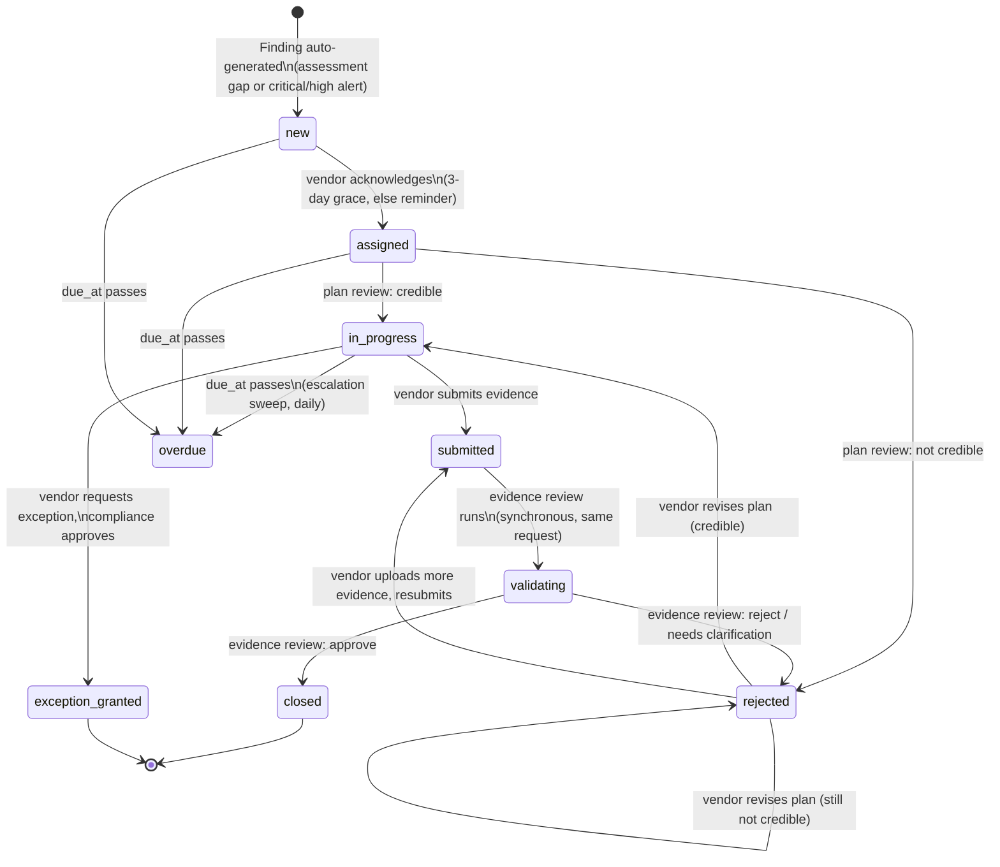

# Remediation Workflow State Machine

Phase 3 deliverable. Implemented in
[`app/services/remediation/ticket_engine.py`](../../backend/app/services/remediation/ticket_engine.py).

## States

## Why `rejected` isn't a dead end

The spec's own wording at two different points — "REJECTED (ask vendor to
revise)" during plan review, and "REJECTED (evidence is insufficient,
vendor must provide better proof)" during evidence validation — both mean
*send it back for revision*, not *terminate the ticket*. `rejected` is a
real, visible status (so a vendor sees "this needs rework" rather than the
status silently reverting), and the vendor's next action determines where
it goes: resubmitting a plan re-runs plan review; uploading evidence and
resubmitting re-runs evidence validation. See `ticket_engine.py`'s module
docstring for the exact transition rules.

## Where the intermediate `validating` state actually happens

`submitted -> validating -> (closed | rejected)` all happen inside one
request (`POST /findings/{id}/submit`) — the LLM evidence review runs
synchronously, the same pattern Phase 1 uses for answer analysis on
assessment submit. The `validating` status is still written to the
database (so the audit trail has it), it just doesn't require a second
API call to resolve; a slower live-Anthropic-provider deployment would
still show it as a real, if brief, intermediate state.

## Risk-score effects

- **Closing** a finding reduces the vendor's risk score by a
  severity-weighted amount (critical: -10, high: -6, medium: -3, low: -1)
  — see `ticket_engine.CLOSURE_RISK_REDUCTION`. This deliberately doesn't
  try to be the exact inverse of whatever alert or assessment originally
  raised the score; it's a documented, defensible proxy for "one fewer
  open gap," not a precise accounting reversal.
- **Exception approval** applies half that reduction — the risk is
  formally *accepted*, not eliminated, so the vendor's score should
  reflect that it's still there, just knowingly tolerated.
